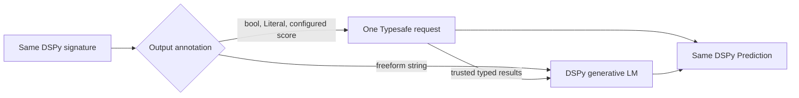

# `typesafeify`: a Typesafe decorator for DSPy

This is a deliberately stripped-down proof-of-concept fork of
[DSPy](https://github.com/stanfordnlp/dspy). It exists to test one idea in
isolation: can a normal DSPy signature opt into Typesafe's typed inference path
with one decorator, while application code keeps constructing and calling
`dspy.Predict` exactly as before?


The meaningful integration diff is intentionally tiny:

```diff
 from typing import Literal

 import dspy
+from typesafe_dspy import typesafeify

+@typesafeify(score_fields={"severity_score": [1, 5]})
 class SupportTicketTriage(dspy.Signature):
     ticket: dict = dspy.InputField()
     customer_impacting: bool = dspy.OutputField()
     owner_team: Literal["api-platform", "billing", "checkout", "infra", "support-ops"] = dspy.OutputField()
     severity_score: float = dspy.OutputField()
     internal_summary: str = dspy.OutputField()
```

The caller does not learn a new predictor API:

```python
predictor = dspy.Predict(SupportTicketTriage)
result = predictor(**ticket_context)
```

## What happens after adding the decorator

`@typesafeify(...)` reads the signature's output annotations and builds a
hybrid execution plan.



| Signature output | Plain DSPy | With `@typesafeify(...)` |
| --- | --- | --- |
| `customer_impacting`, `needs_human_now` | Generated by the DSPy LM | Typesafe `Noul` probabilities, thresholded into `bool` |
| `owner_team`, `severity_band` | Generated by the DSPy LM | Typesafe `Choice` decisions with per-option probabilities |
| `severity_score` | Generated by the DSPy LM | Typesafe `Score`, mapped back onto the declared 1–5 scale |
| `internal_summary` | Generated by the DSPy LM | Generated by the DSPy LM after the five typed results are known |

The demo keeps separate baseline and decorated signature files only to make a
controlled before/after run possible. Before sending either request, it proves
that both signatures have identical fields and instructions.

## Run the comparison

### Explicit TypeSafe-only prediction without monkey-patching

Use `TypesafePredict` directly when every output should come from TypeSafe.
This path does not require `configure_typesafe()`, `install()`, a decorator, or
a configured DSPy LM. `strict=True` rejects outputs that would require an LM,
including an unconfigured numeric output, before any inference call. The default
remains hybrid execution for existing callers.

```python
import dspy
from typesafe_sdk import TypeSafeClient
from typesafe_dspy import Score, TypesafeConfig, TypesafePredict, typesafe_results

class Review(dspy.Signature):
    """Evaluate the evidence in the passage."""
    passage: str = dspy.InputField()
    supported: bool = dspy.OutputField(desc="Does the passage support its claim?")
    relevance: Score["Unrelated", "Partial evidence", "Direct evidence"] = dspy.OutputField(
        desc="How relevant is the evidence to the claim?"
    )

predict = TypesafePredict(
    Review,
    typesafe_config=TypesafeConfig(client=TypeSafeClient(), model="jev-latest"),
    strict=True,
)
result = predict(passage="...")
score = result.relevance
probabilities = typesafe_results(result)["relevance"].probabilities
```

`Score[...]` carries the rubric in the signature. It creates a float subtype with
ordered, equally spaced levels: this example returns a number in 0–2, including
intermediate values such as 1.6. Each Score output can declare a different rubric.
Arithmetic produces ordinary floats; probabilities stay in `typesafe_results`.
Pydantic validation rejects nonfinite or out-of-range values, and the JSON schema
includes the numeric range and level descriptions. Rubrics need at least two
distinct, nonempty descriptions and cannot conflict with field overrides.

To specify a different starting point or unequal spacing, use explicit anchors:

```python
severity: Score[(1, "Low"), (3, "Medium"), (10, "Critical")] = dspy.OutputField()
```

Anchors must be finite, strictly increasing numbers. Jev receives the ordered
descriptions; the integration maps its probability distribution onto your anchors
and returns their weighted mean, not a description string or the winning anchor.
For example, probabilities 0.1, 0.4, and 0.5 produce a numeric score of 6.3.
Each output can use its own scale. Shorthand descriptions still mean 0, 1, 2, …;
do not mix shorthand descriptions and explicit pairs in one rubric.

Field descriptions are model-visible context, separate from the rubric levels.
With the default request builders, `OutputField(desc=...)` is included at
`questions[field].instructions.output_field.description`, alongside the signature
instructions at `questions[field].instructions.task`. This applies to bool, Literal,
and Score outputs. Input and output descriptions also appear in shared `state` at
`signature.inputs[field].description` and `signature.outputs[field].description`.
An explicit `TypesafeFieldConfig(instructions=...)` replaces that question's default
instructions; the default shared state still includes its field description.

This is a runtime prototype, not a promise of static type-checker support for
string-valued type parameters. DSPy state loading preserves the rubric when
loading into an existing matching signature; JSON state alone does not recreate
the type declaration. The existing float output plus
`TypesafeFieldConfig(score_levels=...)` API remains available.
Import order does not affect signature definitions, and the explicit predictor
does not change DSPy's methods or field metadata registry. Avoid the decorator
and `configure_typesafe()` if you do not want their opt-in global interception.

### Hybrid comparison demo

Install the published Typesafe SDK and this fork's development dependencies:

```bash
uv sync --extra typesafe
```

Set `OPENAI_API_KEY` and `TYPESAFE_API_KEY`, then run the same three tickets
through both paths. Luna uses medium reasoning by default.

```bash
OPENAI_MODEL=gpt-5.6-luna \
  uv run python examples/typesafe_dspy_ticket_triage/run_demo.py \
  --limit 3 \
  --show-document
```

The command prints the execution plan, exact signature-parity check, typed
results and probabilities, field-by-field output differences, freeform text,
timing, token usage, and total modeled cost for every case.

## Before/after benchmark

Across the three observed cases, the decorated path averaged **1.958 seconds**
versus **2.329 seconds** for plain DSPy: **15.9% faster**, or a projected
**37.1 seconds saved per 100 sequential calls**. Average modeled cost fell from
**$0.000377 to $0.000263 per ticket**, a **30.1% reduction**.

The cost calculation will use these explicit inputs:

| Input | Rate | Status |
| --- | ---: | --- |
| Typesafe input tokens | $0.042 / 1M tokens | Supplied estimate; replace with a public pricing source when available |
| GPT-5.6 Luna input tokens | $0.20 / 1M tokens | [Published OpenAI rate](https://developers.openai.com/api/docs/models/gpt-5.6-luna) |
| GPT-5.6 Luna output and reasoning tokens | $1.20 / 1M tokens | [Published OpenAI rate](https://developers.openai.com/api/docs/models/gpt-5.6-luna) |

The modeled totals use every priced category in the table: Luna input,
Luna output plus reasoning, and Typesafe input. Typesafe output-token usage is
reported by the demo but is not assigned a cost because the supplied Typesafe
rate covers input tokens only.

## Proof-of-concept layout

- [`typesafe_dspy/hybrid.py`](typesafe_dspy/hybrid.py): decorator, signature
  planning, hybrid execution, and result metadata
- [`examples/typesafe_dspy_ticket_triage/`](examples/typesafe_dspy_ticket_triage/):
  runnable controlled comparison
- [`tests/typesafe_dspy/test_hybrid.py`](tests/typesafe_dspy/test_hybrid.py):
  behavior and score-scale preservation tests

This fork is an experiment, not a replacement distribution for upstream DSPy.
For DSPy itself, use the [upstream project and documentation](https://dspy.ai/).
