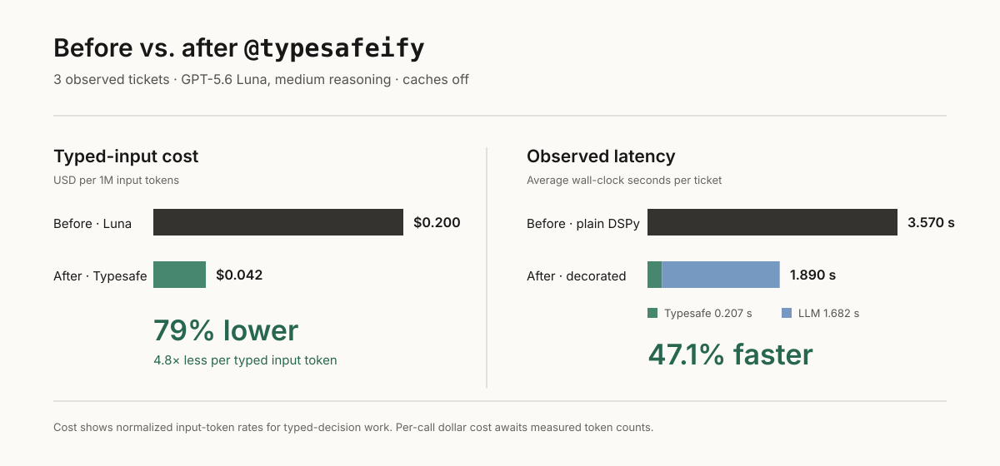

# DSPy + Typesafe Decorator Proof of Concept

This repository is a deliberately stripped-down DSPy fork. It exists to test
one idea in isolation: can an ordinary DSPy signature opt into Typesafe's typed
inference path by adding one decorator, without changing the application code
that constructs or calls `dspy.Predict`?

The proof of concept keeps the signature and predictor intact. The meaningful
code change is the import and decorator below.

```diff
 from typing import Literal

 import dspy
+from typesafe_dspy import typesafeify

+@typesafeify(score_fields={"severity_score": [1, 5]})
 class SupportTicketTriage(dspy.Signature):
     ticket: dict = dspy.InputField()
     customer_impacting: bool = dspy.OutputField()
     owner_team: Literal["api-platform", "billing", "checkout", "infra", "support-ops"] = dspy.OutputField()
     severity_score: float = dspy.OutputField()
     internal_summary: str = dspy.OutputField()
```

Application code still uses an ordinary predictor:

```python
predictor = dspy.Predict(SupportTicketTriage)
result = predictor(**ticket_context)
```

## From ordinary DSPy to the hybrid path

At planning time, `@typesafeify(...)` reads the output annotations. At runtime,
it sends every supported typed field to Typesafe in one multi-question request,
then gives those resolved values to DSPy as trusted inputs for any remaining
freeform fields.

| Signature output | Plain DSPy | With `@typesafeify(...)` |
| --- | --- | --- |
| `customer_impacting`, `needs_human_now` | Generated by the DSPy LM | Typesafe `Noul` probabilities, thresholded into `bool` |
| `owner_team`, `severity_band` | Generated by the DSPy LM | Typesafe `Choice` decisions with per-option probabilities |
| `severity_score` | Generated by the DSPy LM | Typesafe `Score`, mapped back onto the declared 1–5 scale |
| `internal_summary` | Generated by the DSPy LM | Generated by the DSPy LM after the five typed results are known |

The demo keeps separate baseline and decorated signature files only to run a
controlled before/after comparison. It checks that their fields and
instructions are otherwise identical before making either request.

## Before/after benchmark

The run compares the same three tickets through both paths:

- **Before:** one DSPy/Luna prediction produces all six outputs.
- **After:** one Typesafe request resolves five typed decisions, then DSPy/Luna
  produces only `internal_summary` with those decisions supplied as trusted
  inputs.

Run the comparison and retain its complete output:

```bash
OPENAI_MODEL=gpt-5.6-luna \
  uv run python examples/typesafe_dspy_ticket_triage/run_demo.py \
  --limit 3 \
  --show-document
```

Across the three observed cases, the decorated path averaged **1.890 seconds**
versus **3.570 seconds** for plain DSPy: **47.1% faster**, or a projected
**2m48s saved per 100 sequential calls**. Eleven of the twelve categorical
typed decisions agreed; the one difference was an `owner_team` choice.



The pricing model will use the proposed Typesafe input rate of **$0.042 per
million tokens** and [GPT-5.6 Luna at medium reasoning](https://developers.openai.com/api/docs/models/gpt-5.6-luna),
whose published rates are **$0.20 per million input tokens** and **$1.20 per
million output tokens**. The Typesafe rate remains an explicitly supplied
assumption until there is a public pricing source to link. Medium reasoning is
Luna's default; its billed reasoning-token volume must come from the observed
run rather than the unit-price table. Because this run did not report token
counts, the figure compares normalized input-token rates and does not claim a
dollar cost per call.

## Files

- `run_demo.py`: runnable demo script
- `signature_baseline.py`: plain DSPy signature
- `signature_typesafe.py`: the same signature with `@typesafeify(...)`
- `sample_data.py`: sample ticket inputs
- `.env.example`: environment variables

## Run It

Install the Typesafe extra, set the environment variables from `.env.example`,
and run. This selects Luna so the live comparison matches the pricing assumptions above;
medium is the model's default reasoning effort.

```bash
uv sync --extra typesafe
OPENAI_MODEL=gpt-5.6-luna \
  uv run python examples/typesafe_dspy_ticket_triage/run_demo.py --show-document
```

The script prints:

- the hybrid signature plan
- a parity check proving the two signatures are structurally identical
- a preview of the structured Typesafe document
- per-case baseline vs Typesafe summaries
- a side-by-side field delta table
- wrapped freeform text outputs for both runs
- per-case timing split and batch timing summary

## Notes

- `OPENAI_MODEL` controls the DSPy LM used for the freeform string fields.
- `OPENAI_MAX_TOKENS` caps the OpenAI response length for both paths.
- `TYPESAFE_MODEL` controls the Typesafe inference model used for the typed fields.
- DSPy disk cache, memory cache, and LM request cache are disabled so each run
  executes from scratch.
- The script intentionally errors out if `OPENAI_API_KEY` or `TYPESAFE_API_KEY` is missing.
